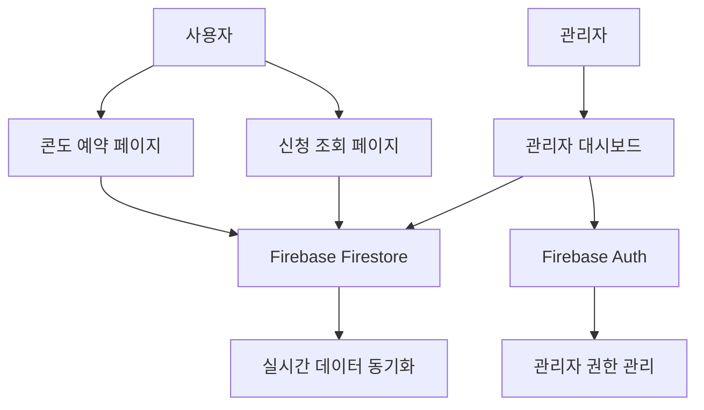

# 🏨 법인콘도 예약 시스템

**2025년 하계성수기 법인콘도 예약 신청 및 관리 시스템**


## 📋 목차

- [프로젝트 소개](#-프로젝트-소개)
- [주요 기능](#-주요-기능)
- [시스템 구조](#-시스템-구조)
- [설치 및 설정](#-설치-및-설정)
- [사용 방법](#-사용-방법)
- [관리자 가이드](#-관리자-가이드)
- [배포](#-배포)
- [기여하기](#-기여하기)
- [라이선스](#-라이선스)

## 🎯 프로젝트 소개

법인 직원들이 하계성수기 콘도를 편리하게 신청하고, 관리자가 효율적으로 추첨 및 관리할 수 있는 웹 애플리케이션입니다.

### ✨ 특징

- 📱 **반응형 디자인** - 모바일, 태블릿, 데스크톱 지원
- 🔥 **실시간 데이터** - Firebase Firestore 기반 실시간 동기화
- 🎨 **현대적 UI/UX** - Tailwind CSS 활용한 세련된 인터페이스
- 🔐 **안전한 인증** - Firebase Authentication 기반 관리자 시스템
- 📊 **통계 및 차트** - Chart.js 활용한 시각적 데이터 분석
- 📤 **데이터 내보내기** - Excel/CSV 형태로 데이터 다운로드

## 🚀 주요 기능

### 👥 사용자 기능

- **콘도 예약 신청**
  - 달력 뷰와 리스트 뷰 지원
  - 예약 가능한 날짜 표시
  - 콘도별 상세 정보 확인
  - 실시간 유효성 검증

- **신청 내역 관리**
  - 사번+성명으로 조회
  - 신청 정보 수정
  - 신청 취소 (마감일 전까지)
  - 추첨 결과 확인

### 👨‍💼 관리자 기능

- **대시보드**
  - 실시간 통계 (전체/당첨/대기/탈락)
  - 콘도별/일별 신청 현황 차트
  - Firebase 연결 상태 모니터링

- **신청 관리**
  - 전체 신청 목록 조회
  - 검색 및 필터링
  - 개별/일괄 상태 변경
  - 신청 상세 정보 확인

- **추첨 시스템**
  - 자동 추첨 실행
  - 수동 당첨자 선정
  - 추첨 결과 초기화
  - 결과 Excel 다운로드

## 🏗️ 시스템 구조

```
condo-reservation-system/
├── 📄 index.html              # 메인 예약 페이지
├── 📄 my-application.html     # 신청 조회 페이지
├── 📄 admin.html              # 관리자 대시보드
├── 🔧 firebase-config.js      # Firebase 설정
├── 📜 script.js               # 메인 JavaScript
├── 🎨 styles.css              # 커스텀 스타일
├── 📚 README.md               # 프로젝트 문서
├── 🚫 .gitignore              # Git 제외 파일
└── 🔧 firebase.json           # Firebase 호스팅 설정
```

### 🏛️ 아키텍처



## ⚙️ 설치 및 설정

### 1. 프로젝트 클론

```bash
git clone https://github.com/YOUR_USERNAME/condo-reservation-system.git
cd condo-reservation-system
```

### 2. Firebase 프로젝트 설정

1. [Firebase 콘솔](https://console.firebase.google.com)에서 새 프로젝트 생성
2. **Authentication** 활성화 (이메일/비밀번호 방식)
3. **Firestore Database** 생성
4. **프로젝트 설정**에서 웹 앱 추가 및 구성 정보 복사

### 3. Firebase 구성 업데이트

`firebase-config.js` 파일의 설정을 본인의 Firebase 프로젝트로 수정:

```javascript
const firebaseConfig = {
  apiKey: "YOUR_API_KEY",
  authDomain: "YOUR_PROJECT.firebaseapp.com",
  projectId: "YOUR_PROJECT_ID",
  storageBucket: "YOUR_PROJECT.firebasestorage.app",
  messagingSenderId: "YOUR_SENDER_ID",
  appId: "YOUR_APP_ID"
};
```

### 4. Firestore 보안 규칙 설정

Firebase 콘솔에서 다음 규칙 적용:

```javascript
rules_version = '2';
service cloud.firestore {
  match /databases/{database}/documents {
    // 관리자 컬렉션
    match /admins/{adminId} {
      allow read, write: if request.auth != null && request.auth.uid == adminId;
    }
    
    // 신청 컬렉션
    match /applications/{applicationId} {
      function isAdmin() {
        return request.auth != null && 
               exists(/databases/$(database)/documents/admins/$(request.auth.uid));
      }
      
      allow read, write, delete: if isAdmin();
      allow create: if request.auth == null;
    }
  }
}
```

### 5. 관리자 계정 생성

첫 관리자 계정은 웹에서 직접 생성하거나, 개발자 도구에서 다음 코드 실행:

```javascript
// 브라우저 콘솔에서 실행
firebase.auth().createUserWithEmailAndPassword('admin@company.com', 'secure-password')
  .then((userCredential) => {
    return db.collection('admins').doc(userCredential.user.uid).set({
      email: 'admin@company.com',
      role: 'admin',
      createdAt: firebase.firestore.FieldValue.serverTimestamp()
    });
  })
  .then(() => console.log('관리자 계정 생성 완료'));
```

## 📖 사용 방법

### 👤 일반 사용자

1. **메인 페이지 접속** (`index.html`)
2. **날짜 선택** - 달력에서 예약 가능한 날짜 클릭
3. **콘도 선택** - 해당 날짜의 콘도 중 원하는 것 선택
4. **신청자 정보 입력** - 성명, 사번, 연락처 입력
5. **신청 완료** - 신청하기 버튼 클릭

### 📋 신청 조회

1. **신청 조회 페이지 접속** (`my-application.html`)
2. **사번 + 성명** 입력하여 로그인
3. **신청 내역 확인** - 상태, 콘도 정보 등 확인
4. **필요시 수정/취소** - 마감일 전까지 가능

### 👨‍💼 관리자

1. **관리자 페이지 접속** (`admin.html`)
2. **이메일 + 비밀번호**로 로그인
3. **대시보드 확인** - 통계, 차트 등 모니터링
4. **신청 관리** - 검색, 필터링, 상태 변경
5. **추첨 실행** - 자동 추첨 또는 수동 처리
6. **데이터 내보내기** - Excel/JSON 형태로 다운로드

## 🛡️ 관리자 가이드

### 📊 대시보드 기능

- **실시간 통계** - 전체/당첨/대기/탈락 신청 수
- **차트 분석** - 콘도별, 일별 신청 현황
- **Firebase 상태** - 연결 상태 실시간 모니터링

### 🎯 추첨 관리

- **자동 추첨** - 콘도별로 랜덤 추첨 실행
- **수동 처리** - 개별 신청 상태 변경
- **일괄 처리** - 여러 신청을 한 번에 처리
- **결과 초기화** - 모든 추첨 결과를 대기 상태로 되돌리기

### 📤 데이터 관리

- **Excel 내보내기** - 전체 신청 데이터 CSV 다운로드
- **JSON 백업** - 원본 데이터 백업
- **검색/필터링** - 이름, 사번, 콘도명으로 검색

## 🚀 배포

### Firebase Hosting 배포

```bash
# Firebase CLI 설치
npm install -g firebase-tools

# Firebase 로그인
firebase login

# 프로젝트 초기화
firebase init hosting

# 배포
firebase deploy
```

### GitHub Pages 배포

1. GitHub 저장소의 **Settings** 탭 이동
2. **Pages** 섹션에서 **Source**를 `Deploy from a branch`로 설정
3. **Branch**를 `main`으로 선택
4. 배포 완료 후 제공되는 URL로 접속

## 🔧 환경별 설정

### 개발 환경

```bash
# 로컬 서버 실행 (Python 3)
python -m http.server 8000

# 또는 Node.js
npx http-server
```

### 프로덕션 환경

- **HTTPS 필수** - Firebase Authentication 요구사항
- **도메인 설정** - Firebase 콘솔에서 승인된 도메인 추가
- **보안 규칙** - Firestore 보안 규칙 적용
- **모니터링** - Firebase 성능 모니터링 활성화

## 📈 성능 최적화

- **이미지 최적화** - WebP 형식 사용
- **CSS 최적화** - 불필요한 Tailwind 클래스 제거
- **JavaScript 최적화** - 코드 분할 및 지연 로딩
- **캐싱 전략** - Firebase Hosting 캐시 설정

## 🐛 문제 해결

### 자주 발생하는 문제들

1. **Firebase 연결 실패**
   ```javascript
   // 브라우저 콘솔에서 확인
   console.log('Firebase apps:', firebase.apps.length);
   ```

2. **권한 오류**
   - Firestore 보안 규칙 확인
   - 관리자 계정 권한 확인

3. **데이터 로드 실패**
   - 네트워크 연결 상태 확인
   - Firebase 프로젝트 상태 확인

## 🤝 기여하기

1. 저장소 Fork
2. 기능 브랜치 생성 (`git checkout -b feature/AmazingFeature`)
3. 변경사항 커밋 (`git commit -m 'Add some AmazingFeature'`)
4. 브랜치에 Push (`git push origin feature/AmazingFeature`)
5. Pull Request 생성

### 코딩 컨벤션

- **JavaScript**: ES6+ 문법 사용
- **CSS**: Tailwind CSS 우선, 커스텀 CSS 최소화
- **HTML**: 시맨틱 태그 사용
- **주석**: 복잡한 로직에는 한글 주석 추가

## 📝 업데이트 로그

### v1.0.0 (2025-06-11)
- 🎉 초기 릴리즈
- 기본 예약 기능 구현
- 관리자 대시보드 추가
- Firebase 연동 완료

### 향후 계획
- [ ] 📧 이메일 알림 기능
- [ ] 📱 PWA 지원
- [ ] 🔔 푸시 알림
- [ ] 📊 고급 통계 분석
- [ ] 🌐 다국어 지원

## 📞 지원

- **이슈 신고**: [GitHub Issues](https://github.com/YOUR_USERNAME/condo-reservation-system/issues)
- **기능 제안**: [GitHub Discussions](https://github.com/YOUR_USERNAME/condo-reservation-system/discussions)
- **문서**: [Wiki](https://github.com/YOUR_USERNAME/condo-reservation-system/wiki)

## 📄 라이선스

이 프로젝트는 MIT 라이선스를 따릅니다. 자세한 내용은 [LICENSE](LICENSE) 파일을 참조하세요.

---

<div align="center">

**Made with ❤️ for better condo reservation experience**

[🏠 홈페이지](https://your-domain.com) • [📖 문서](https://github.com/YOUR_USERNAME/condo-reservation-system/wiki) • [🐛 버그 신고](https://github.com/YOUR_USERNAME/condo-reservation-system/issues)

</div>